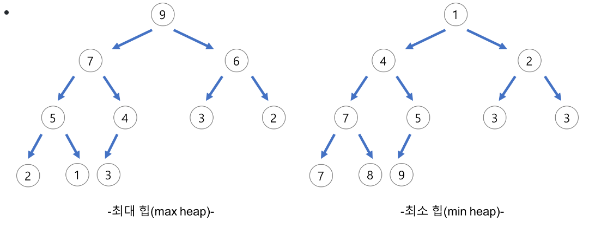
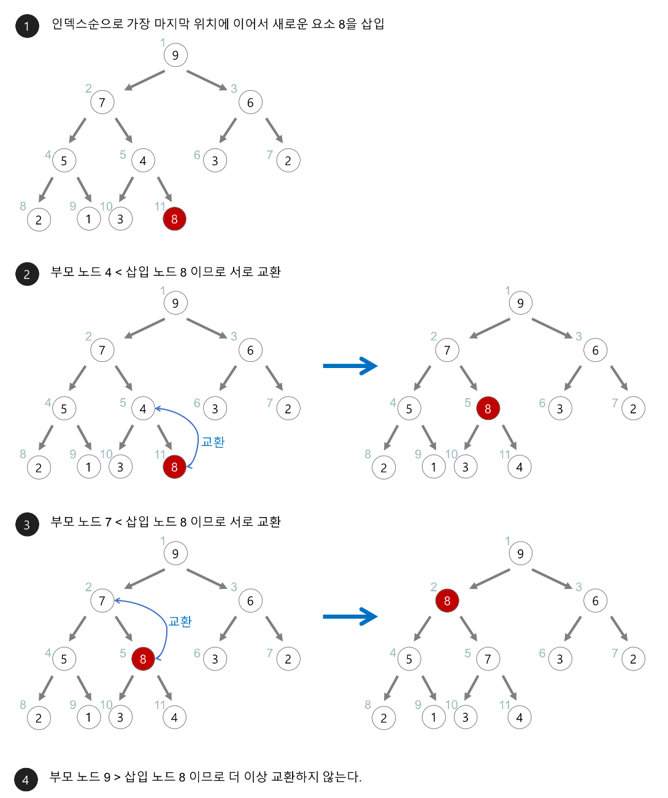
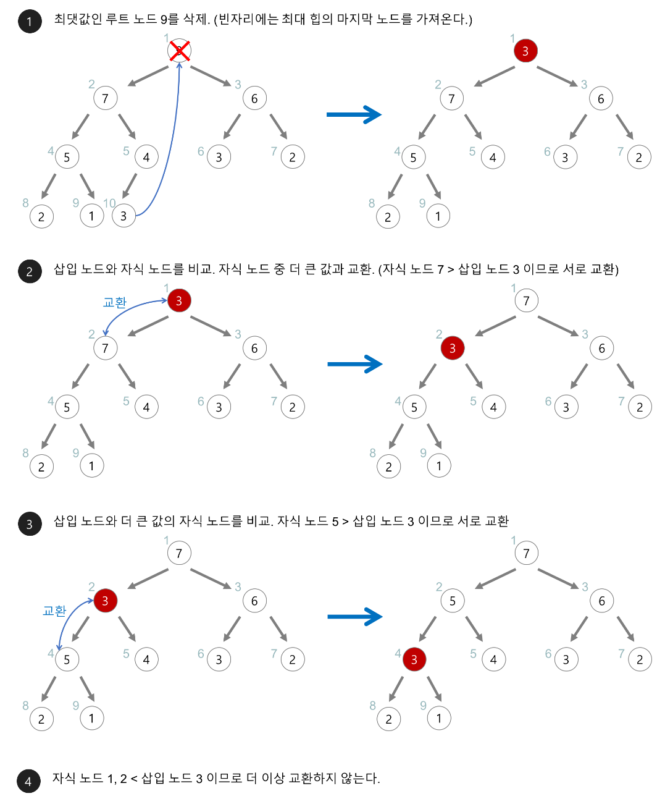

# Heap
- 완전 이진 트리의 일종
- 우선순위 큐를 위하여 만들어진 자료구조
- 여러 값들 중 최대값이나 최소값을 빠르게 찾아내도록 만들어짐
- 삽입과 삭제 시 완전 이진 트리의 정렬 과정이 필요하여 O(logN) 의 시간복잡도를 가짐
- 최대 힙 : 부모 노드 >= 자식 노드, 최소 힙 : 부모 노드 <= 자식 노드

# Heap 의 삽입과 삭제 과정

### 1. 삽입

### 2. 삭제
