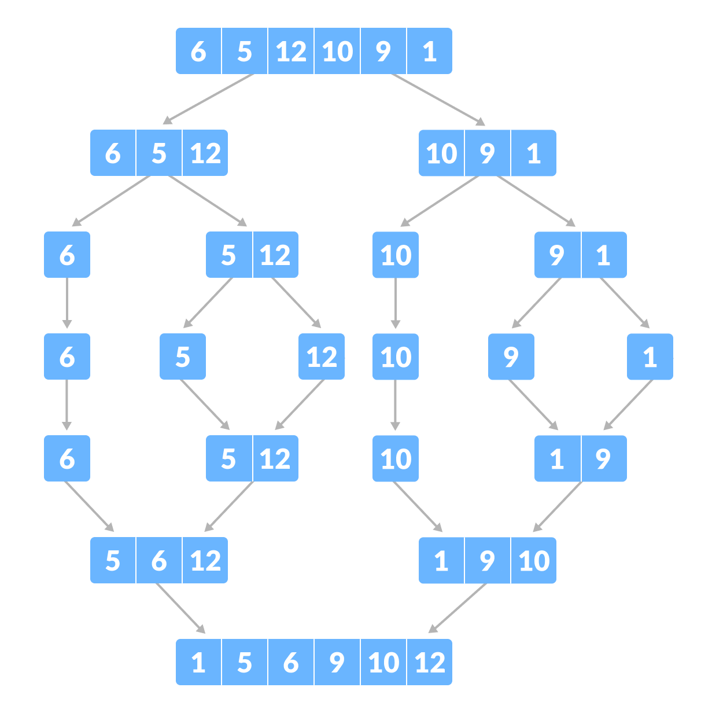

# Merge Sort

- 분할 정복 방식에 기반한 정렬 알고리즘
- O(NlogN) 의 시간복잡도를 가짐
- 크게 분할 - 병합 두 과정으로 나뉘는데 실제 정렬은 분할된 두 배열을 병합하는 과정에서 일어남




```
public static void mergeSort(int[] numbers, int left, int right) {
    if (left >= right) return;
    
    int mid = (left + right) / 2;
    mergeSort(numbers, left, mid);
    mergeSort(numbers, mid + 1, right);
    merge(numbers, left, mid, right);   
}

public static void merge(int[] numbers, int left, int mid, int right) {
    int[] temp = new int[right - left + 1];
    
    int i = left;
    int j = mid + 1;
    int k = 0;
    
    while (i <= mid && j <= right) {
        if (numbers[i] < numbers[j]) {
            temp[k++] = numbers[i++];
        } else {
            temp[k++] = numbers[j++];
        }
    }
    
    for (int l = i; l <= mid; l++) {
        temp[k++] = numbers[l];
    }
    
    for (int l = j; l <= right; l++) {
        temp[k++] = numbers[l];
    }
    
    for (int l = left; l <= right; l++) {
        numbers[l] = temp[l - left];
    }
}

```