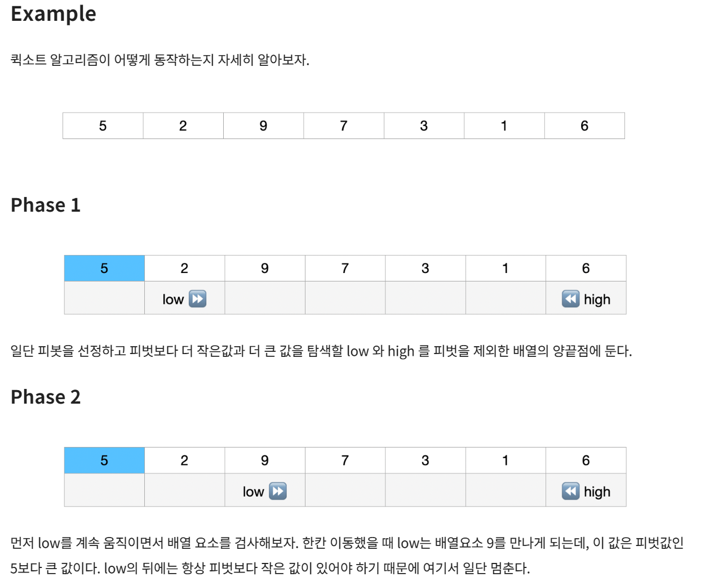
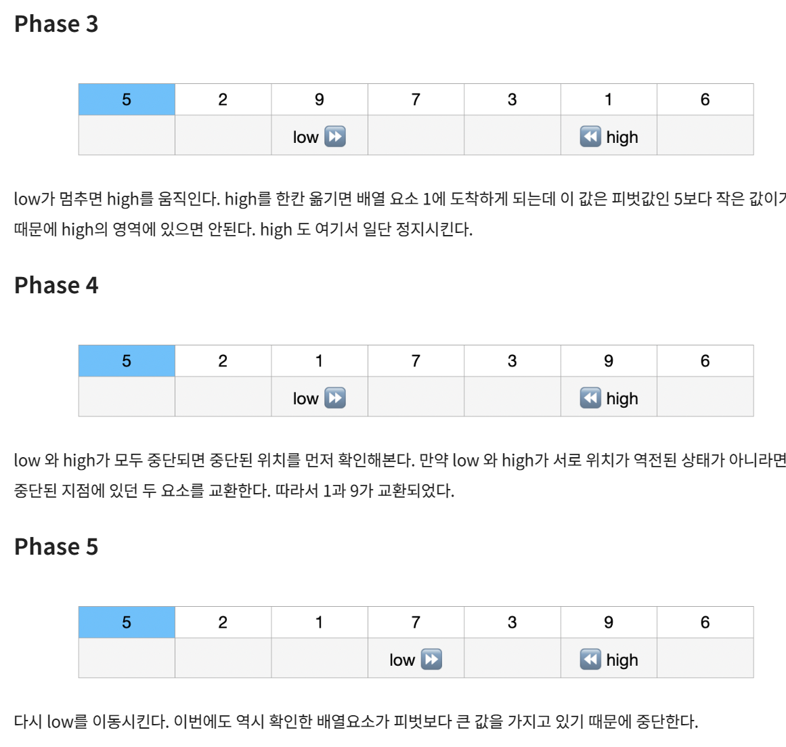
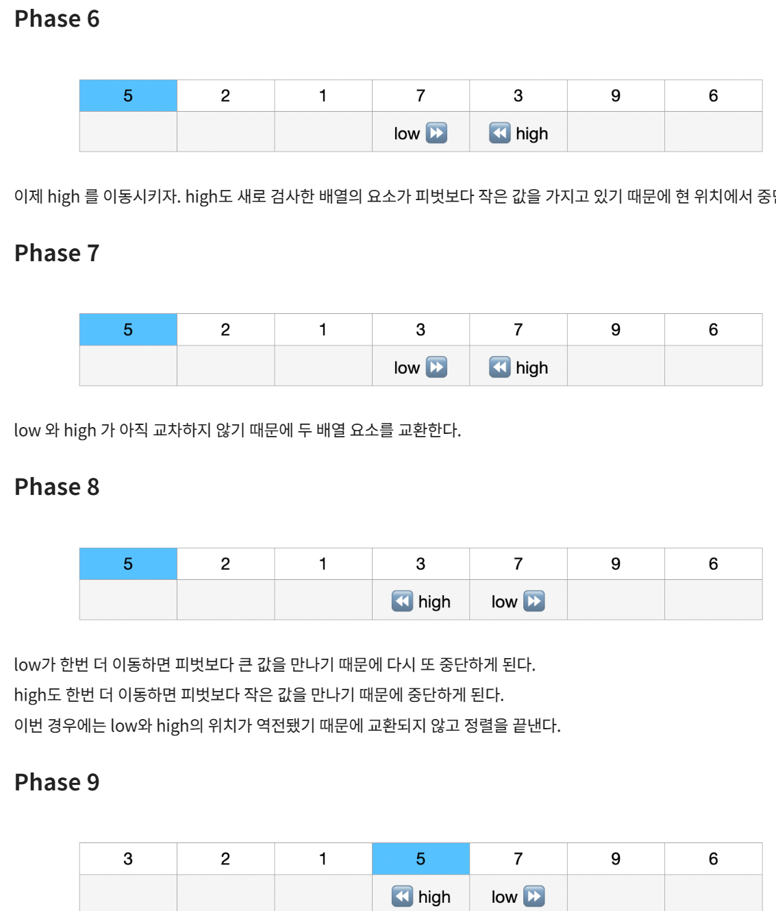

# Quick Sort

- 퀵소트 알고리즘을 pivot 을 기준으로 pivot 보다 작은 값들은 왼쪽에 큰 값은 오른쪽에 오게 하는 방식
- 나눈 배열 각가에 대해 다시 pivot 을 정하고 같은 과정을 반복
- 배열의 크기가 1 이 되면 분할을 멈춤
- 배열이 아름답게 이등분이 잘 된다면 logN 높이의 트리 형태에 각 높이에서 N 번의 연산이 발생할 것이므로 O(NlogN)
- 최악의 경우 한쪽 배열만 존재해서 등분이 안 되면 N - 1 높이에 N 번의 연산이 발생하니 O(N^2)

