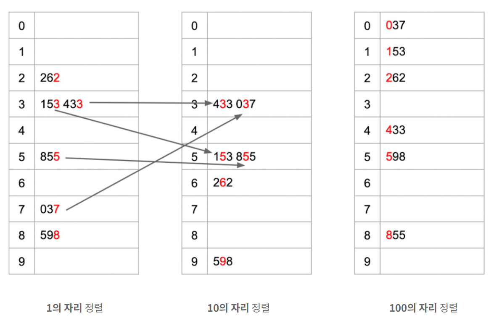

# Radix Sort(기수 정렬)

- 기수 정렬은 주어진 수들간의 직접적인 비교를 하지 않고 낮은 자리(1의 자리) 에서 높은 자리(10^n) 순으로 버킷에 넣는 방법으로 정렬한다.
- 주어진 숫자의 최대 자릿수 : r
- 시간복잡도 : O(rN)
- 시간복잡도 상으로는 매우 좋은 알고리즘이지만 추가적인 메모리가 많이 필요하여 공간복잡도 상으로는 좋지 않다.

